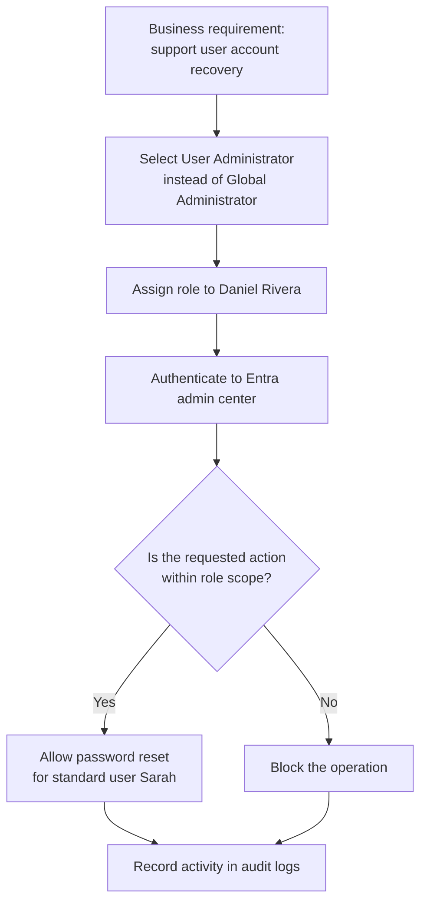
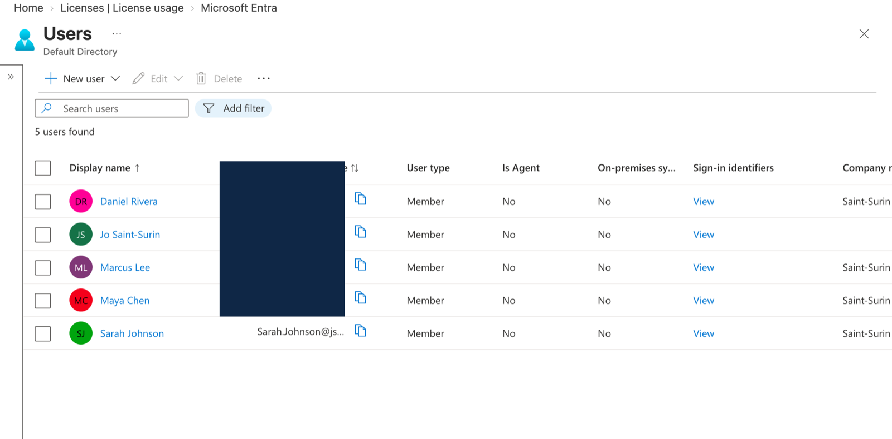
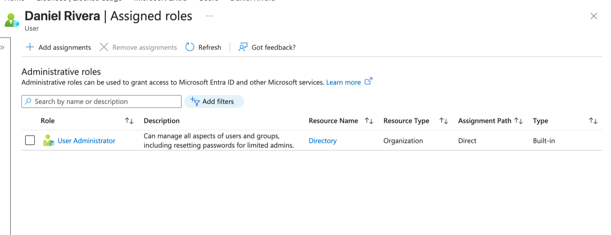
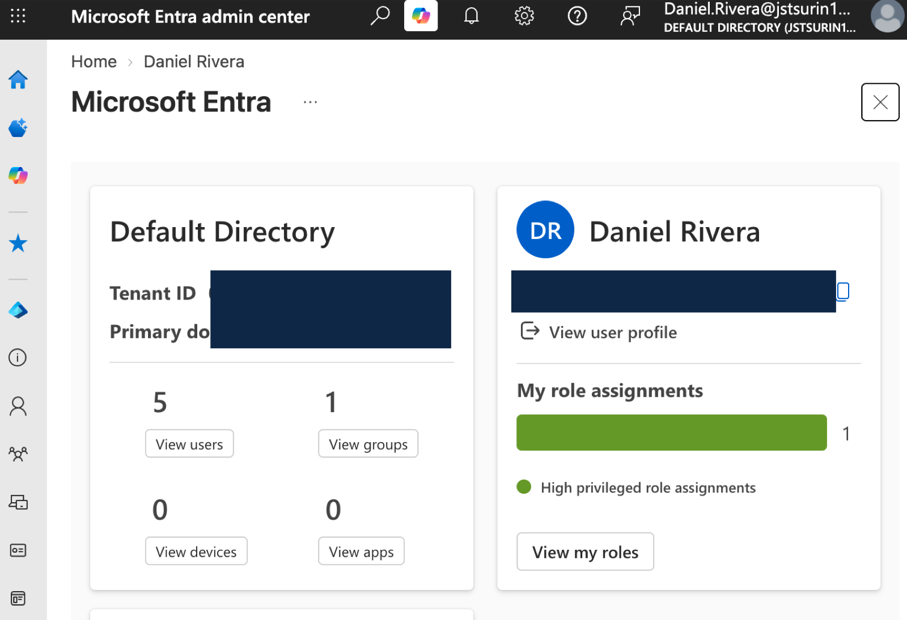
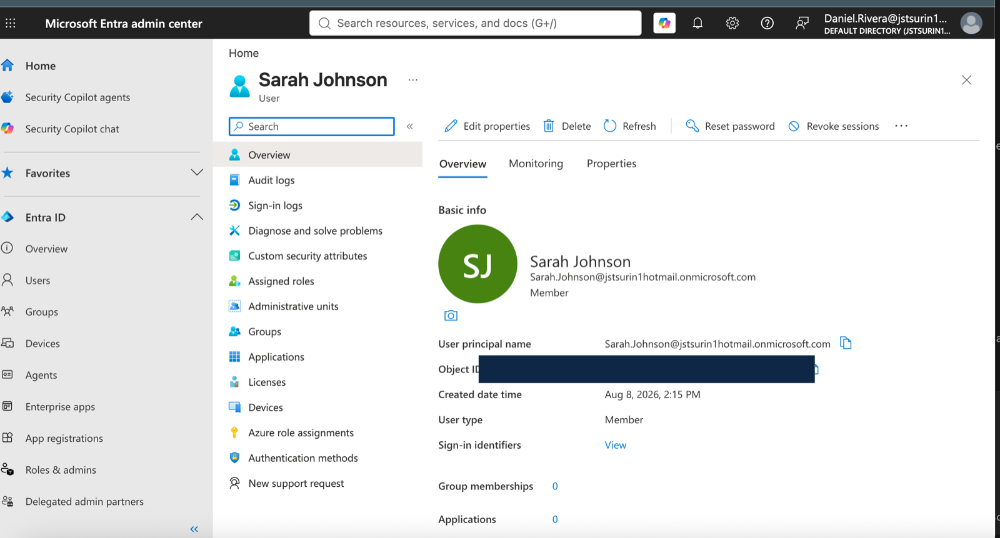
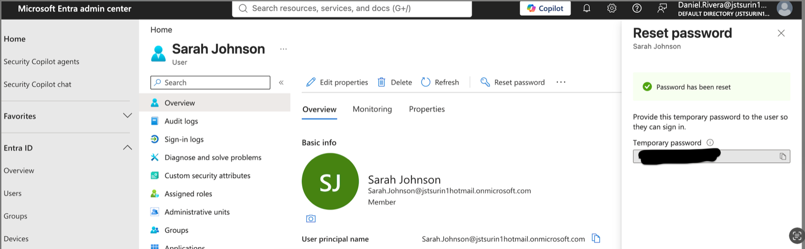
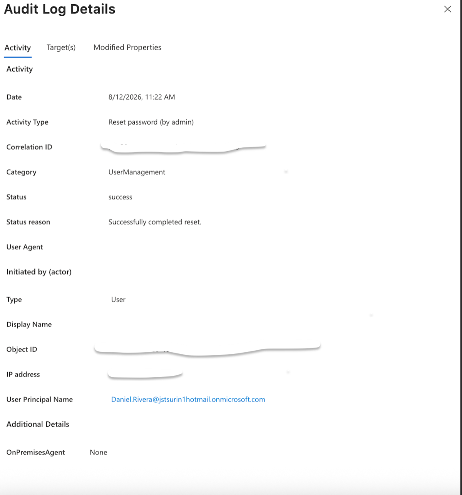
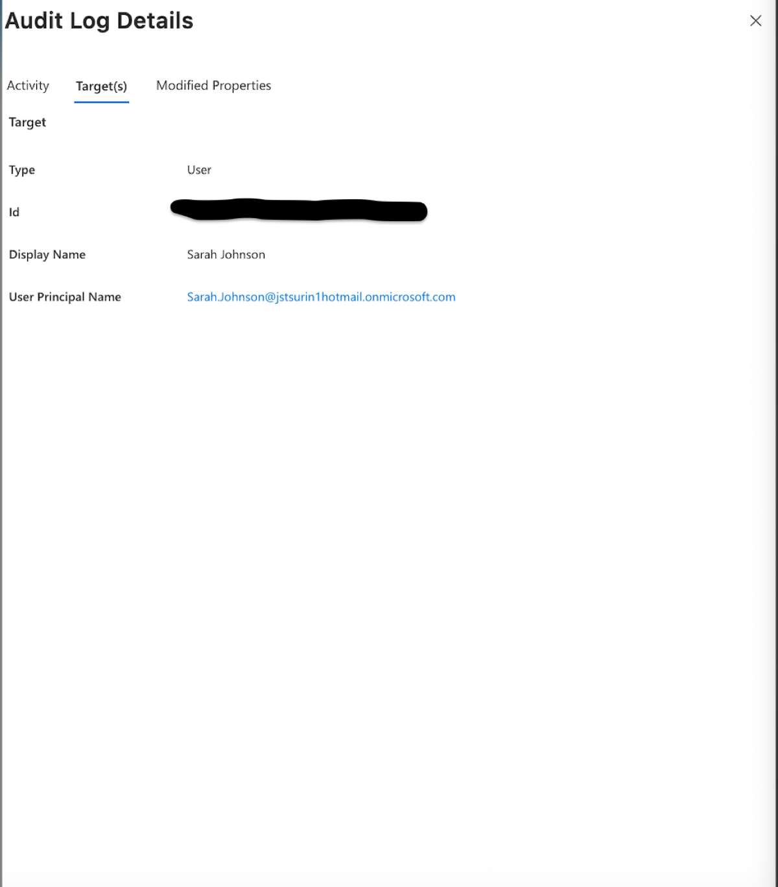
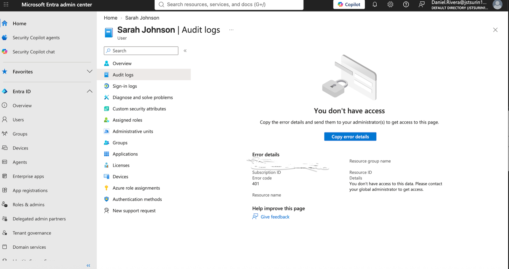

# Microsoft Entra ID RBAC and Delegated Administration

## Executive summary

This case study models a common enterprise IAM requirement: allowing a support administrator to manage standard user accounts without granting full control of the Microsoft Entra tenant.

Daniel Rivera was assigned the **User Administrator** role while Sarah Johnson remained a standard user. Daniel authenticated to the Entra admin center, opened Sarah’s user record, and successfully initiated a password reset. The exercise demonstrated delegated administration and a least-privilege role design without relying on Global Administrator for the support task.

| Case-study detail | Value |
|---|---|
| Platform | Microsoft Entra ID |
| Environment | Cloud-only lab tenant |
| Control | Directory role-based access control (RBAC) |
| Delegated role | User Administrator |
| Administrative identity | Daniel Rivera |
| Target identity | Sarah Johnson, standard user |
| Validated operation | Standard-user password reset |
| Evidence state | Seven-part sanitized evidence set published |

## Business scenario

A support administrator needs to handle routine account-recovery requests. Assigning Global Administrator would make the task possible, but would also expose unrelated tenant settings and high-impact privileges. The safer design is to assign a narrower role aligned to the operator’s job function.

## Objectives

- Create realistic cloud-only test identities.
- Delegate user-management capability to a named administrator.
- Confirm that the delegated administrator can authenticate.
- Validate an authorized password-reset workflow for a standard user.
- Demonstrate least privilege without claiming permissions that were not tested.
- Capture repeatable evidence for configuration, execution, auditability, and restriction testing.

## Identity and authorization model

The design separates two decisions:

1. **Authentication:** Is Daniel the identity he claims to be?
2. **Authorization:** Does Daniel’s assigned role permit this operation against this target?

## Implementation

1. Created cloud test identities in the Microsoft Entra tenant.
2. Kept Sarah Johnson as a standard user.
3. Assigned Daniel Rivera the **User Administrator** directory role.
4. Signed out of the privileged setup session and signed in as Daniel.
5. Opened Sarah’s user record in the Entra admin center.
6. Selected **Reset password** and completed the reset workflow.
7. Confirmed that Entra generated a temporary password and required a password change at the next sign-in.

> Temporary passwords must never appear in a public screenshot or repository. Any captured result should be redacted before publication.

## Validation matrix

| Test | Expected result | Observed result | Status | Evidence |
|---|---|---|---|---|
| Test identities exist | Daniel and Sarah appear in the user list | Five test identities, including Daniel and Sarah, are visible | Passed | E01 |
| Role assignment | Daniel has User Administrator | Direct, built-in assignment is visible | Passed | E02 |
| Delegated sign-in | Daniel can access the Entra admin center | Daniel’s authenticated Entra session is visible | Passed | E03 |
| Password-reset option | Sarah’s user page exposes the authorized reset action | Reset password is available while Daniel is signed in | Passed | E04 |
| Password-reset execution | Entra completes the reset and issues a temporary password | Entra reports “Password has been reset” | Passed | E05; secret redacted |
| Auditability | Audit logs identify the activity, actor, target, and result | Successful reset is attributed to Daniel and targets Sarah | Passed | E06A–E06B |
| Negative authorization test | An operation outside User Administrator scope is denied | Sarah’s audit-log data returns a 401 access denial to Daniel | Passed | E07 |

The matrix separates expected behavior from observed results and maps each result to committed evidence.

## Evidence register

| ID | Planned artifact | What it should prove | Repository status |
|---|---|---|---|
| E01 | Test-user list | Daniel and Sarah exist as cloud identities | Published |
| E02 | Daniel’s role assignment | User Administrator is assigned to Daniel | Published |
| E03 | Daniel signed into Entra | Administrative session uses Daniel’s identity | Published |
| E04 | Sarah’s user page | Reset password is available for the standard user | Published |
| E05 | Successful reset | The authorized workflow completed | Published |
| E06 | Audit-log event | Actor, activity, target, outcome, and timestamp align | Published as actor and target views |
| E07 | Least-privilege restriction | Audit-log data is denied outside the delegated role boundary | Published |

Detailed capture, redaction, sizing, filename, and caption requirements are in the [evidence guide](../docs/evidence-guide.md).

## Evidence

### E01 — Test identities

*Figure 1. Cloud test identities used to validate delegated administration in the Microsoft Entra lab tenant. User principal names are redacted.*

### E02 — Delegated role assignment

*Figure 2. Daniel Rivera holds a direct, organization-level assignment to the built-in User Administrator role.*

### E03 — Authenticated administrative session

*Figure 3. Microsoft Entra admin center session authenticated as Daniel Rivera; tenant and object identifiers are redacted.*

### E04 — Authorized password-reset action

*Figure 4. While authenticated as Daniel Rivera, the delegated User Administrator can access the password-reset action for Sarah Johnson’s standard-user account.*

### E05 — Successful password reset

*Figure 5. Microsoft Entra confirms completion of the delegated password reset for Sarah Johnson; the temporary password is redacted.*

### E06 — Audit correlation

*Figure 6A–B. Microsoft Entra records a successful administrator-initiated password reset by Daniel Rivera and identifies Sarah Johnson as the target. Correlation, object, and network identifiers are redacted.*

### E07 — Least-privilege boundary

*Figure 7. Daniel Rivera’s User Administrator role permits the user-support task but does not provide access to Sarah Johnson’s audit-log data; the portal returns a 401 denial.*

## Security analysis

### Why User Administrator

The role supports common user-administration duties while avoiding the broad tenant control associated with Global Administrator. This matches access to a defined support responsibility instead of organizational seniority or convenience.

### Risk reduction

- Reduces the blast radius if Daniel’s account is compromised.
- Limits accidental changes to unrelated tenant-wide controls.
- Improves attribution by using a named delegated identity for the action.
- Supports review and investigation when paired with audit logs.

### Important limitations

- A directory role is still privileged access and should be protected with strong authentication and monitored.
- This lab documents a standing role assignment; it does not claim just-in-time activation or Privileged Identity Management.
- The denial test demonstrates one specific boundary—access to the target user’s audit-log data—and does not claim to enumerate every permission in the role.

## Result

The delegated administrator completed the required standard-user password reset without using a Global Administrator session for the task. Authentic evidence validates the role assignment, delegated session, authorized action, successful result, audit correlation, and a denied out-of-scope operation.

## Lessons learned

- Authentication and authorization are separate controls and should be validated separately.
- A role assignment should be tested with both an allowed operation and a denied or unavailable out-of-scope operation.
- Audit evidence is strongest when the actor, target, activity, result, and time can be correlated.
- Recruiter-facing documentation should distinguish implementation claims from committed evidence.

## Next steps

1. Extend the lab with phishing-resistant MFA and Conditional Access.
2. Evaluate eligible, time-bound role activation through Privileged Identity Management.
3. Add alerting and review procedures for privileged password-reset activity.
4. Document joiner–mover–leaver lifecycle controls and access reviews.

## Interview talking points

See [interview talking points](../docs/interview-talking-points.md) for concise ways to explain the design decision, validation method, risk reduction, and future improvements.
