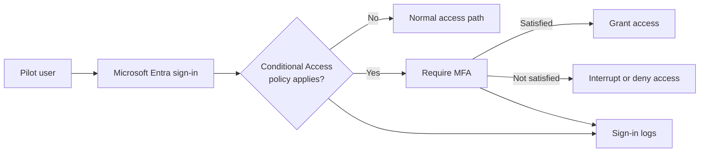

# Lab 2: Microsoft Entra Conditional Access & MFA

> **Status:** In progress — tenant assessment and validation pending

## Business scenario

An organization needs stronger authentication for cloud access without risking a tenant-wide lockout. A controlled pilot will require multifactor authentication for a test user, evaluate the policy before enforcement, and validate the result through Microsoft Entra sign-in logs.

## Objectives

- Confirm licensing and existing identity-security settings.
- Create a dedicated MFA pilot group.
- Scope Conditional Access to a test identity.
- Exclude an emergency-access identity before enforcement.
- Evaluate the policy in report-only mode.
- Validate successful and interrupted MFA journeys.
- Correlate policy evaluation with sign-in logs.

## Authentication flow

## Safety gates

The policy will not be enabled until all gates pass:

- [ ] Conditional Access availability is confirmed.
- [ ] Existing Security Defaults and policies are reviewed.
- [ ] A separate emergency-access identity is identified and excluded.
- [ ] Only the pilot group is included.
- [ ] Report-only results match the intended scope.
- [ ] A separate browser session is available for testing.

## Implementation plan

1. Assess the tenant license, Security Defaults, authentication methods, and current policies.
2. Capture the baseline state and a pre-policy sign-in.
3. Create `CA-MFA-Pilot-Users` and add the selected test user.
4. Register an approved MFA method for the test user.
5. Create `CA-Require-MFA-Pilot-Users` with an emergency-access exclusion.
6. Set the policy to **Report-only**.
7. Generate a test sign-in and review the projected policy result.
8. Enable the policy only after scope and exclusions are verified.
9. Test successful MFA and an interrupted or unsatisfied MFA journey.
10. Correlate each result with Microsoft Entra sign-in logs.

## Validation matrix

| Test | Expected result | Status | Evidence |
|---|---|---|---|
| Feature availability | Tenant exposes the required controls | Pending | E01 |
| Pilot scope | Test user is included through the pilot group | Pending | E02 |
| Emergency exclusion | Emergency-access identity is excluded | Pending | E03 |
| Report-only evaluation | Policy is evaluated without enforcement | Pending | E04 |
| MFA enforcement | Pilot user is challenged for MFA | Pending | E05 |
| Successful MFA | Access is granted after MFA succeeds | Pending | E06 |
| Unsatisfied MFA | Access is interrupted or denied | Pending | E07 |
| Log correlation | Sign-in logs identify user, policy, and result | Pending | E08 |

## Planned evidence

| ID | Artifact | What it must prove |
|---|---|---|
| E01 | Conditional Access overview | Feature availability and baseline policy state |
| E02 | Pilot-group membership | Selected test user is in scope |
| E03 | Policy assignments | Pilot inclusion and emergency-access exclusion |
| E04 | Report-only result | Policy evaluates as designed before enforcement |
| E05 | MFA prompt | The pilot sign-in requires another factor |
| E06 | Successful sign-in | Access follows successful MFA |
| E07 | Interrupted sign-in | MFA not satisfied prevents normal access |
| E08 | Sign-in-log details | User, policy, authentication requirement, and result correlate |

Screenshots will be added only after authentic tenant validation. Passwords, QR codes, phone numbers, tenant and object IDs, IP addresses, and correlation or session IDs will be redacted when unnecessary.

## Current boundary

This file documents the planned control and test method. It does not yet claim that Conditional Access or MFA has been configured, enforced, or validated.
