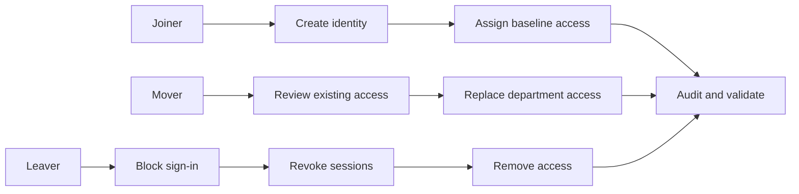

# Lab 3: Joiner–Mover–Leaver Identity Lifecycle

> **Status:** Planned — implementation and evidence pending

## Business scenario

An organization needs a repeatable process to provision a new employee, adjust access after a department transfer, and remove access promptly at separation.

## Objectives

- Establish a source-of-truth identity profile.
- Use groups to assign department access.
- Validate joiner, mover, and leaver controls.
- Preserve accountability through audit logs.
- Verify that access is removed, not merely hidden.

## Lifecycle flow

## Planned validation

| Test | Expected result | Status |
|---|---|---|
| Joiner provisioning | New identity receives only approved baseline access | Pending |
| Department access | Group membership grants intended access | Pending |
| Mover cleanup | Previous department access is removed | Pending |
| Mover assignment | New department access is added | Pending |
| Leaver containment | Sign-in is blocked and sessions are revoked | Pending |
| Auditability | Lifecycle actions identify actor, target, and result | Pending |

## Planned evidence

Identity profile, baseline groups, joiner result, before/after mover memberships, blocked leaver account, session revocation, final access state, and audit events.

## Current boundary

This framework does not claim that lifecycle actions have been performed. Results will be added only after authentic validation.
