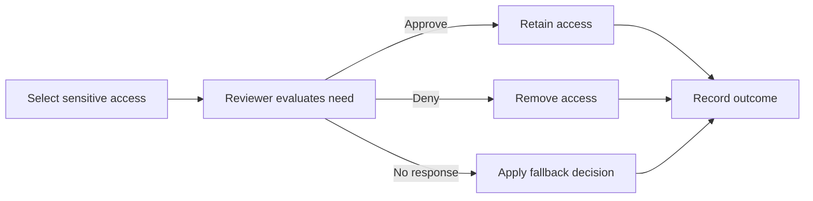

# Lab 4: Access Reviews and Governance

> **Status:** Planned — feature availability, implementation, and evidence pending

## Business scenario

An organization needs periodic confirmation that users still require privileged or sensitive group access. Access that cannot be justified should be removed through a documented review process.

## Objectives

- Identify reviewable access and an accountable reviewer.
- Define review scope, frequency, and decision criteria.
- Record approve, deny, and no-response outcomes.
- Validate remediation after the review.
- Document licensing limitations if native access reviews are unavailable.

## Governance flow

## Planned validation

| Test | Expected result | Status |
|---|---|---|
| Feature assessment | Native capability or documented manual alternative is identified | Pending |
| Review scope | Only intended group or application access is included | Pending |
| Reviewer decision | Decision and justification are recorded | Pending |
| Remediation | Denied access is removed | Pending |
| Retention | Approved access remains | Pending |
| Auditability | Review history supports later investigation | Pending |

## Planned evidence

License/capability assessment, sensitive group, review configuration, reviewer experience, decision results, remediated membership, and audit history.

## Current boundary

No access review or remediation result is claimed until the tenant workflow is completed and evidenced.
