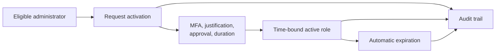

# Lab 5: Privileged Identity Management

> **Status:** Planned — feature availability, implementation, and evidence pending

## Business scenario

An organization wants to replace unnecessary standing administrative access with eligible, time-bound activation protected by approval, justification, and strong authentication.

## Objectives

- Assess Privileged Identity Management availability.
- Compare standing, eligible, and active role assignments.
- Configure a safe activation workflow where supported.
- Validate activation, expiration, and audit history.
- Document a least-privilege alternative if licensing is unavailable.

## Privilege flow

## Planned validation

| Test | Expected result | Status |
|---|---|---|
| Feature assessment | Licensing and tenant capability are documented | Pending |
| Eligibility | Test administrator is eligible, not permanently active | Pending |
| Activation controls | Required controls are enforced | Pending |
| Active window | Role works only during approved activation | Pending |
| Expiration | Privilege ends automatically | Pending |
| Auditability | Request, approval, activation, and expiration correlate | Pending |

## Planned evidence

Capability assessment, eligible assignment, activation controls, request, approval or justification, active role, expiration, and audit history.

## Current boundary

This lab does not claim PIM availability or activation until licensing and authentic tenant evidence confirm it.
