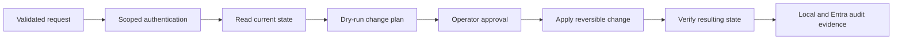

# Lab 6: IAM Automation with Microsoft Graph

> **Status:** Planned — implementation, safe testing, and evidence pending

## Business scenario

Repeated identity tasks create delay and inconsistency when performed manually. A controlled automation workflow should read identity state, apply an approved change, verify the result, and produce an auditable record without embedding credentials.

## Objectives

- Use Microsoft Graph with least-privilege permissions.
- Separate configuration from secrets.
- Automate one reversible identity-management task.
- Add input validation, error handling, and dry-run behavior.
- Verify idempotency and audit correlation.

## Automation flow

## Planned validation

| Test | Expected result | Status |
|---|---|---|
| Secret hygiene | No credential or token is stored in Git | Pending |
| Least privilege | Graph permissions match the single task | Pending |
| Dry run | Proposed changes are visible without mutation | Pending |
| Successful change | Approved change is applied once | Pending |
| Idempotency | Re-running does not duplicate the result | Pending |
| Failure handling | Invalid input fails safely | Pending |
| Auditability | Automation identity and target correlate in logs | Pending |

## Planned evidence

Permission scope, sanitized configuration, dry run, successful execution, before/after state, repeated run, safe failure, and audit event.

## Current boundary

No automation or Graph permission is claimed until the script, tenant result, and evidence are committed. Secrets will never be added to this repository.
