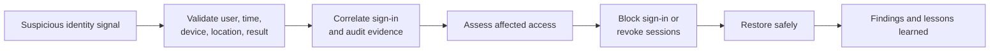

# Lab 7: Identity Security Investigation

> **Status:** Planned — scenario execution and evidence pending

## Business scenario

The security team must investigate suspicious identity activity, determine what occurred, assess impact, contain the account safely, and document defensible findings from Microsoft Entra evidence.

## Objectives

- Establish a known benign baseline.
- Generate a safe lab anomaly without simulating harmful activity.
- Correlate sign-in and audit events.
- Distinguish observation, inference, and conclusion.
- Apply reversible containment and verify recovery.

## Investigation flow

## Planned validation

| Test | Expected result | Status |
|---|---|---|
| Baseline | Normal sign-in behavior is documented | Pending |
| Detection | Lab anomaly is visible in available logs | Pending |
| Correlation | User, time, application, result, and related actions align | Pending |
| Containment | Selected containment prevents continued access | Pending |
| Recovery | Account returns to a verified safe state | Pending |
| Reporting | Findings separate facts from inference | Pending |

## Planned evidence

Baseline event, investigation trigger, sign-in details, correlated audit event, containment action, post-containment test, recovery, and incident timeline.

## Current boundary

No compromise or production incident is claimed. The future scenario will use safe lab activity and evidence-supported conclusions only.
