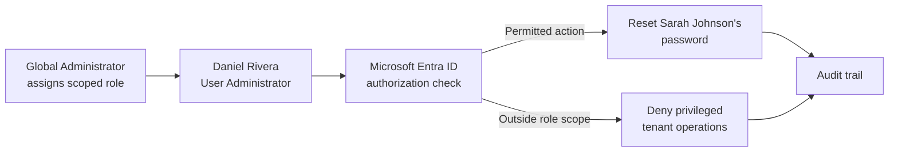

# Enterprise IAM Homelab

Hands-on identity and access management case studies built in Microsoft Entra ID. This portfolio documents the business problem, control design, implementation, validation, and security reasoning behind each lab—not just the portal steps.

> **Current case study:** Microsoft Entra ID RBAC and delegated administration<br>
> **Status:** Complete · Seven-part evidence set published

## Portfolio at a glance

| Area | Demonstrated capability | Status |
|---|---|---|
| Identity administration | Cloud test identities and standard-user administration | Complete |
| Role-based access control | User Administrator assigned to a delegated operator | Complete |
| Authentication | Delegated administrator signed into the Entra admin center | Complete |
| Authorization | Password reset completed for a standard user | Complete |
| Least privilege | User Administrator can reset a standard-user password but cannot access audit data | Validated |
| Auditability | Successful reset correlated to Daniel as actor and Sarah as target | Validated |

## Featured case study

### Microsoft Entra ID RBAC and Delegated Administration

**Business problem:** Help-desk personnel need to perform routine user support without receiving unrestricted tenant control.

**Implementation:** Daniel Rivera was assigned the **User Administrator** role. Sarah Johnson remained a standard user. After signing in as Daniel, Sarah’s password was reset through the Entra admin center.

**Security outcome:** The task was completed with a purpose-built administrative role instead of Global Administrator, reducing standing privilege and limiting the potential impact of account compromise or operator error.

[Read the complete case study](01-entra-id-basics/README.md)

## Access-control flow



## Repository structure

```text
enterprise-iam-homelab/
├── README.md
├── 01-entra-id-basics/
│   └── README.md
├── docs/
│   ├── evidence-guide.md
│   └── interview-talking-points.md
└── assets/
    └── screenshots/
        └── entra-rbac/
```

## Evidence standard

Screenshots are treated as supporting artifacts, not decoration. Each artifact shows the relevant portal context, avoids exposing secrets or temporary passwords, uses a consistent presentation width, and includes a caption explaining what the evidence proves.

See the [evidence capture guide](docs/evidence-guide.md) for the seven-artifact checklist and naming convention.

## Security principles demonstrated

- **Least privilege:** grant only the role required for the support task.
- **Separation of duties:** keep routine identity administration separate from tenant-wide administration.
- **Accountability:** associate sensitive actions with a named administrative identity and an audit event.
- **Verification:** test both an allowed action and an action outside the delegated role’s scope.
- **Secret hygiene:** redact temporary passwords, tenant identifiers, and other unnecessary sensitive data from public evidence.

## Roadmap

- Add MFA and Conditional Access validation.
- Document joiner–mover–leaver lifecycle controls.
- Add access reviews, privileged access workflows, automation, and identity-security investigations.

> This repository uses fictional test identities in a lab tenant. It does not contain production credentials or production identity data.
